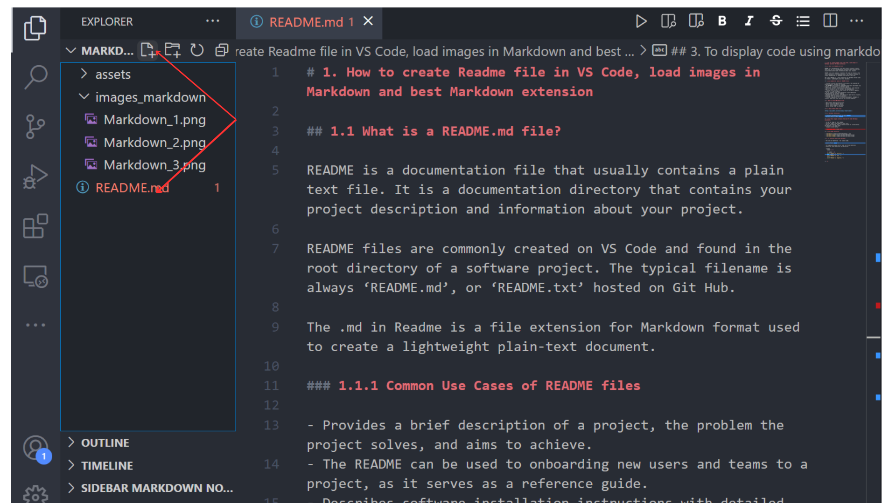
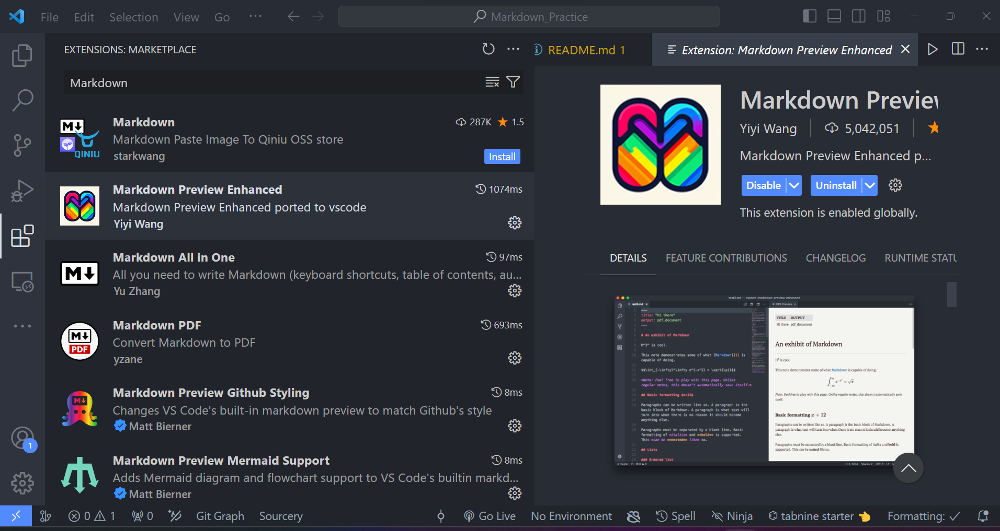
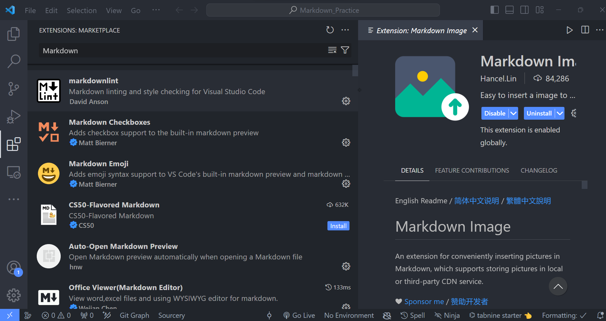
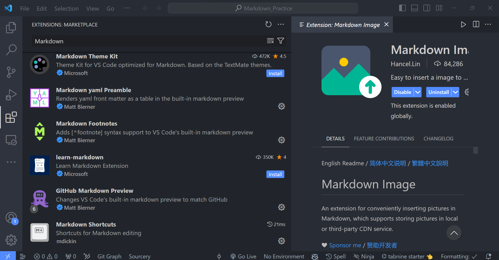
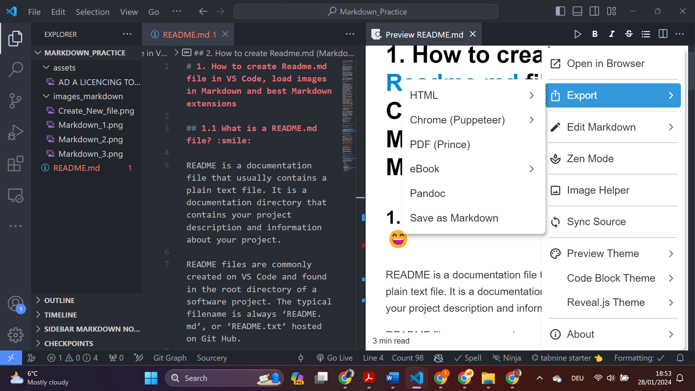

# 1. How to create Readme.md file in VS Code, load images in Markdown and best Markdown extensions
  
## 1.1 What is a README.md file? :smile:
  
README is a documentation file that usually contains a plain text file. It is a documentation directory that contains your project description and information about your project.
  
README files are commonly created on VS Code and found in the root directory of a software project. The typical filename is always ‘README.md’, or ‘README.txt’ hosted on Git Hub.
  
The .md in Readme is a file extension for Markdown format used to create a lightweight plain-text document.
  
### 1.1.1 Common Use Cases of README files
  
- Provides a brief description of a project, the problem the project solves, and aims to achieve.
- The Readme.md can be used to onboarding new users and teams to a project, as it serves as a reference guide.
- Describes software installation instructions with detailed steps to install a set of software and dependencies.
- Provides instructions on how to use new software, updates, syntaxes, or code snippets.
- It can contain links and references to more detailed documentation for further reading.
- Document guidelines for contributing to Open-Source projects, including links to community channels.
- Provides a guideline for software development, changes in tickets, bug fixes, new features and relevant updates.
  
## 2. How to create Readme.md (Markdown file) on VS Code :slightly_smiling_face:
  

  
To view your Readme Markdown after installing the markdown extensions on the images below, right click on your Readme and select *Markdown Readme Enhanced* . This opens your README.md preview on another page.
  
- Emoji Cheat Sheet :cd:
- How to write mark downs syntax :cd:
- How to embed images in markdown :cd:
- How to format code in markdown :cd:
- How to export Readme Markdown into HTML, PDF etc :cd:
  
## 2.1 Emoji Cheat Sheet link :smile:
  
<https://www.webfx.com/tools/emoji-cheat-sheet/>
  
## 2.2 Markdown Extensions
  
- \*github\* markdown preview by Matt Briener
- Markdown Emoji by Matt Briener
  
### 2.2.1 These images contains the best VS Code Markdown extensions
  
- To add an image on your Readme.
- Firstly, import the images on your file.
- Use an exclamation mark in square bracket as written below and declare a an image path.
  -Example stated below:
  
- 
  
### 2.2.3 Image Extension
  
- 
- 
- 
  
## 3. To display code using markdown
  
- You can use backticks ``for single code.
  
  print`("Hello Bafor ")`
  
- To display multiply line of code use three backticks
- State the code name after the backticks.
  
```python
    number = -4
  
    if number > 0:
    print("Number is positive. ")
    elif number == 0:
    print("Number is zero. ")
    else:
    print("Number is negative. ")
```
  
## 4 . Export Readme Markdown into HTML or PDF files
  

  